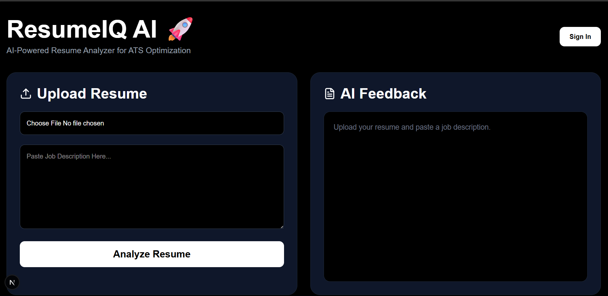
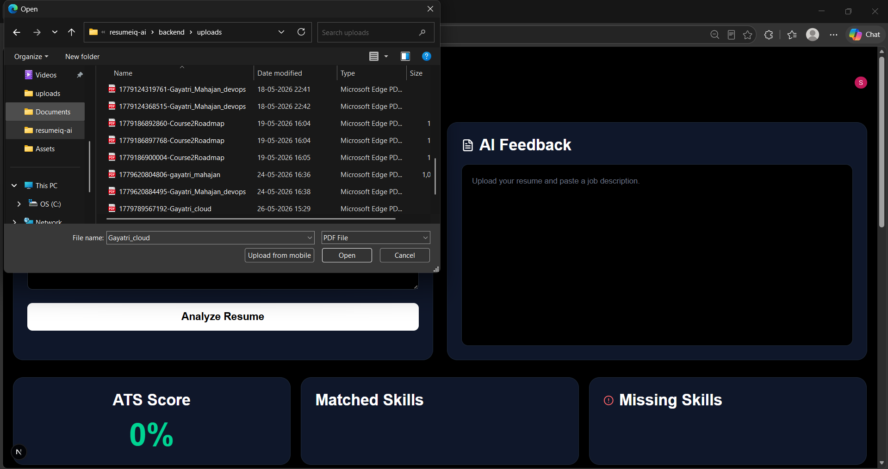
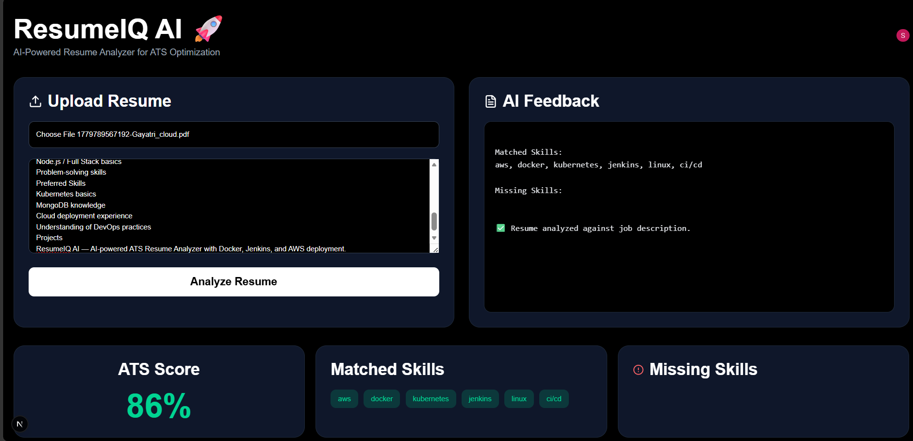
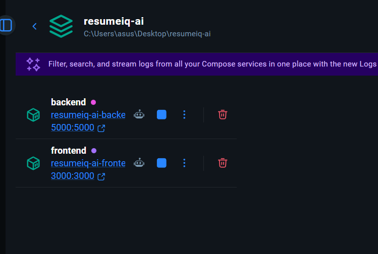
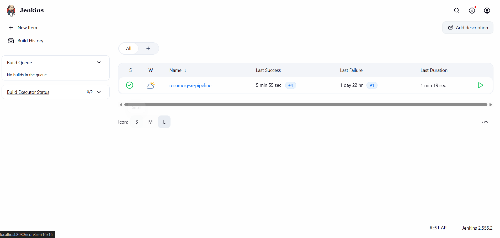

# ResumeIQ AI 🚀

AI-powered ATS Resume Analyzer with Full Stack + DevOps deployment.

---

## 🌟 Features

- Resume Upload & PDF Parsing
- ATS Score Analysis
- Skill Matching System
- Missing Skills Detection
- Resume History Tracking
- Authentication using Clerk
- MongoDB Database Integration
- Dockerized Full Stack Application
- Jenkins CI/CD Pipeline
- AWS EC2 Cloud Deployment

---

## 🛠️ Tech Stack

### Frontend
- Next.js
- React
- Tailwind CSS
- Clerk Authentication

### Backend
- Node.js
- Express.js
- MongoDB Atlas
- Multer
- PDF Parse

### DevOps & Cloud
- Docker
- Docker Compose
- Jenkins
- AWS EC2
- GitHub

---

## 📦 Docker Setup

```bash
docker compose up --build
```

---

## ☁️ AWS Deployment

Application deployed on AWS EC2 using Docker containers.

---

## 🔄 Jenkins CI/CD

Automated CI/CD pipeline using Jenkins:
- GitHub Integration
- Docker Build Automation
- Container Deployment

---

## 🚀 Run Locally

### Frontend

```bash
cd frontend
npm install
npm run dev
```

### Backend

```bash
cd backend
npm install
npm run dev
```

---

## 📂 Project Structure

```bash
resumeiq-ai/
│
├── frontend/
├── backend/
├── docker-compose.yml
├── Jenkinsfile
└── README.md
```

---

## 📸 Screenshots

### 🏠 Home Page


---

### 📄 Resume Upload


---

### 📊 ATS Analysis


---

### 🐳 Docker Deployment


---

### 🔄 Jenkins CI/CD


---

## 👩‍💻 Author

Gayatri Mahajan

---

## ⭐ GitHub Repository

https://github.com/gayatrimahajan26/resumeiq-ai